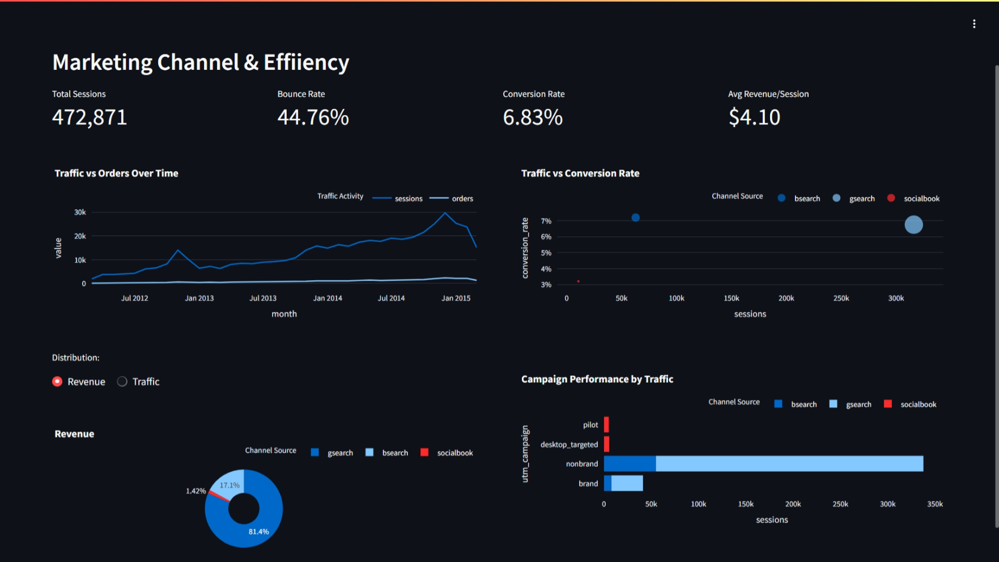
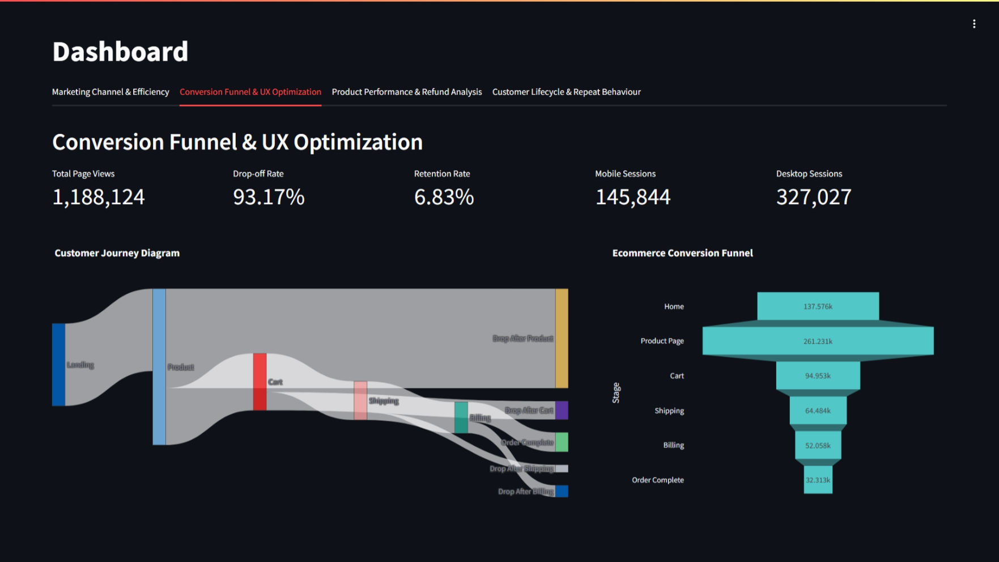
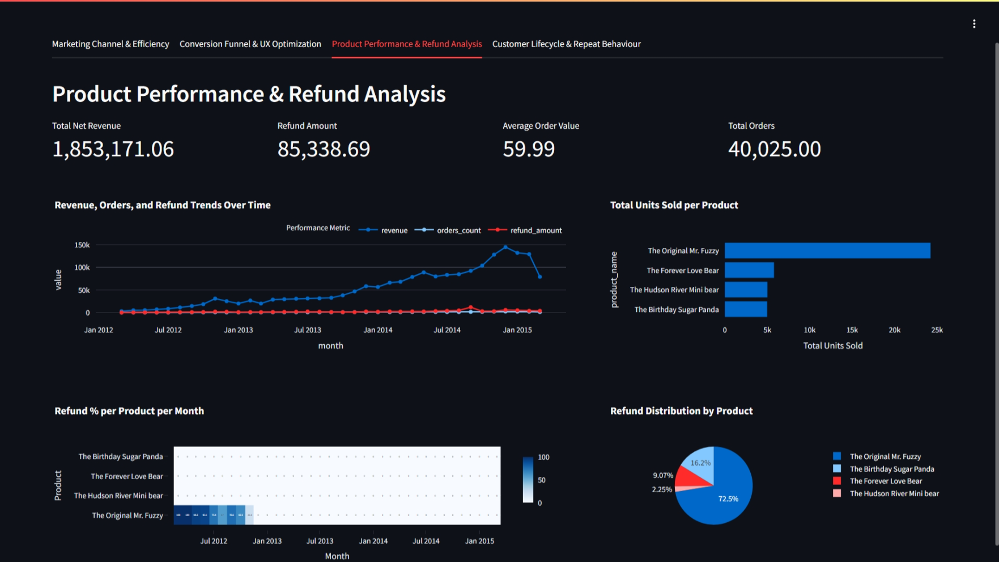
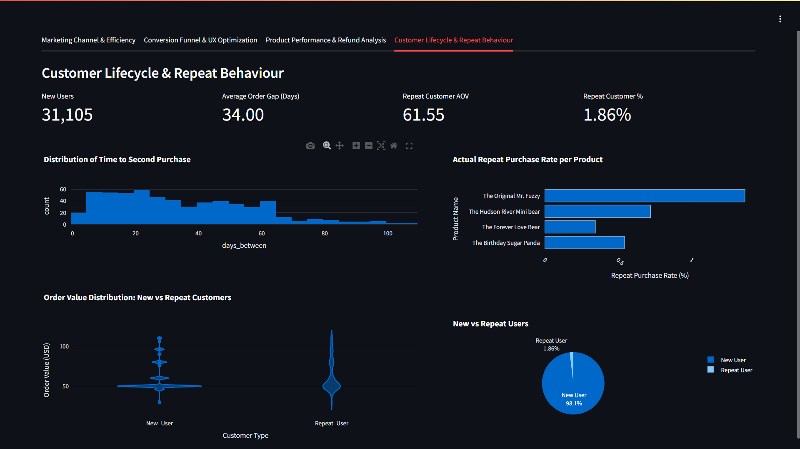

# Ecommerce Growth Analytics Dashboard

An interactive analytics dashboard built using **Streamlit, Pandas, and Plotly** to analyze ecommerce performance across marketing, user behavior, product performance, and customer lifecycle.

## Project Overview

This project focuses on solving key business problems in an ecommerce environment by analyzing:

* Marketing channel effectiveness
* Conversion funnel leakage
* Product performance & refunds
* Customer retention & repeat behavior

The dashboard provides actionable insights through KPIs and interactive visualizations.

## Tech Stack

* Python 🐍
* Streamlit 📊
* Pandas
* Plotly

## Goals & Analysis

### Goal 1: Marketing Channels & Efficiency

#### Objective

Identify high-performing and underperforming marketing channels based on traffic, conversions, and revenue.

#### Key Features:

##### KPI Metrics

* **Total Sessions** – Total number of visits across all channels
* **Bounce Rate** – Percentage of users leaving without interaction
* **Conversion Rate** – Percentage of sessions converting into orders
* **Avg Revenue per Session** – Revenue generated per visit

#### Visual Insights

**1. Traffic vs Orders Over Time**

* Line chart comparing sessions and orders
* Helps identify growth trends and seasonality

**2. Traffic vs Conversion Rate**

* Bubble chart showing channel efficiency
* Highlights which channels convert better

**3. Revenue & Traffic Distribution (Toggle-Based Pie Chart)**

* Interactive pie chart with a toggle between Revenue and Traffic views
* Allows comparison of channel contribution in terms of sessions vs revenue
* Helps identify channels that generate traffic but not revenue

**4. Campaign Performance by Traffic**

* Bar chart comparing campaigns across channels
* Detects high-traffic but low-performing campaigns

#### Key Insights

* Search channels dominate both traffic and revenue
* Some channels drive traffic but fail to convert
* Campaign-level optimization can improve ROI

#### Dashboard Preview



### Goal 2: Conversion Funnel & UX Optimization

#### Objective

Identify customer journey leakage points and optimize the conversion funnel.

#### Key Features:

##### KPI Metrics

* **Total Page Views** – Total number of pages visited
* **Drop-off Rate** – Percentage of users leaving at each stage
* **Retention Rate** – Percentage of users continuing in funnel
* **Mobile Sessions** – Sessions from mobile devices
* **Desktop Sessions** – Sessions from desktop devices

#### Visual Insights

**1. Ecommerce Conversion Funnel**

* Funnel chart showing user flow across stages
* Identifies where users drop off

**2. Customer Journey Sankey Diagram**

* Flow diagram visualizing user transitions
* Shows both progression and drop-offs

####  Key Insights

* Major drop-offs occur at Cart → Shipping → Billing
* Checkout flow likely has UX friction
* Funnel optimization can significantly improve conversions

#### Dashboard Preview



### Goal 3: Product Performance & Refund Analysis

#### Objective:

Evaluate product success and understand refund impact on revenue.

#### Key Features:

##### KPI Metrics

* **Total Net Revenue** – Revenue after deducting refunds
* **Total Refund Amount** – Overall refund impact
* **Average Order Value (AOV)** – Average customer spending
* **Total Orders** – Total number of items sold

#### Visual Insights

**1. Revenue, Orders & Refund Trends**

* Line chart showing monthly trends
* Helps track business growth and refund fluctuations

**2. Total Units Sold per Product**

* Bar chart identifying best-selling products
* Highlights demand patterns

**3. Refund Distribution by Product**

* Pie chart showing refund contribution by product
* Identifies products causing revenue loss

**4. Refund % Heatmap (Product vs Month)**

* Heatmap showing refund rates across time
* Helps detect seasonal or product-specific issues

#### Key Insights

* Certain products generate high revenue but also high refunds
* Refund spikes directly affect profitability
* Product demand varies significantly across categories

#### Dashboard Preview



### Goal 4: Customer Lifecycle & Repeat Behavior

#### Objective

Quantify the value of repeat customers and analyze retention patterns.

#### Key Features

##### KPI Metrics

* **New Users** – Total first-time customers
* **Average Order Gap (Days)** – Time between repeat purchases
* **Repeat Customer AOV** – Spending behavior of loyal customers
* **Repeat Customer %** – Retention rate

#### Visual Insights

**1. Distribution of Time to Second Purchase**

* Histogram showing how quickly customers return
* Helps identify optimal retargeting windows

**2. Order Value Distribution (New vs Repeat)**

* Violin plot comparing spending patterns
* Reveals whether repeat customers spend more

**3. Repeat Purchase Rate by Product**

* Bar chart showing which products drive loyalty
* Identifies high-retention products

**4. New vs Repeat Users Distribution**

* Pie chart showing customer segmentation
* Quick overview of retention health

#### Key Insights

* Repeat customers contribute higher revenue per user
* Majority users are first-time → strong retention opportunity
* Some products drive repeat engagement more than others

#### Dashboard Preview



## How to Run the Project

```bash
git clone https://github.com/your-username/ecommerce-growth-analytics.git
cd ecommerce-growth-analytics
pip install -r requirements.txt
streamlit run dashboard.py
```

### Project Structure
```
ecommerce-growth-engine/
│
├── analysis/
│   ├── GOAL1.ipynb
│   ├── GOAL2.ipynb
│   ├── GOAL3.ipynb
│   ├── GOAL4.ipynb
│   └── ...
│
├── data
├── dashboard.py
├── visualization.py
├── LICENSE
└── README.md
```

## Key Learnings

* Funnel analysis helps identify UX bottlenecks
* Marketing performance should be evaluated beyond traffic
* Refund analysis is critical for profitability
* Retention is more valuable than acquisition

